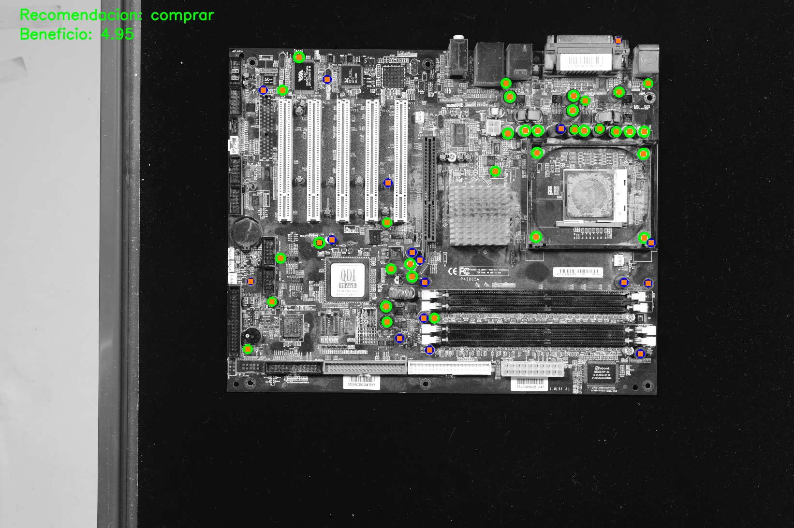
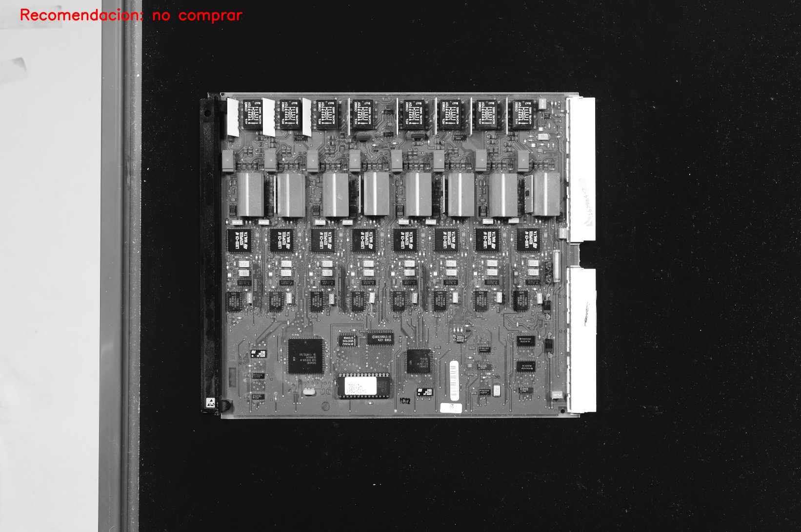

# AIVA_2022_CapacitorDetectLib  
Aplicación que localiza los condensadores de una placa base y recomienda o no su compra. Una placa base tiene un coste de 1 €, los condensadores pequeños valen 5 céntimos y los grandes 15 céntimos. Teniendo esto en cuenta, sólamente si la venta de los condensadores supone un beneficio igual o superior a 1 €, se recomendará la compra. En este caso, además se generará un archivo .txt con la localización de los condensadores.

El programa da la siguiente salida en caso de una placa válida:

  

En caso de que se decida que la placa no es válida, la salida es la siguiente:

  

## Instalación 🔧
### Via Github
1. Elija el directorio en el que desea clonar el proyecto: `cd <ruta_directorio>`
2. Dentro del directorio, ejecute el siguiente comando: `git clone https://github.com/AlejandroURJC/AIVA_2022_CapacitorDetectLib.git`
3. Vaya a la carpeta del proyecto: `cd AIVA_2022_CapacitorDetectLib`
4. Instale las dependencias: `pip install -r requirements.txt`

En caso de surgirle dudas sobre cómo clonar un proyecto acceda al siguiente enlace: [Clonar un repositorio](https://docs.github.com/es/repositories/creating-and-managing-repositories/cloning-a-repository).

### Vía Docker (recomendado)
1. Inicie la aplicación Docker Desktop.
2. Descargue la imagen de la aplicación en su sistema a través del comando: `docker pull alejandrourjc/aiva2022-capdetectlib:1.0`
3. Ejecute el comando `docker run -it --rm alejandrourjc/aiva2022-capdetectlib:1.0 -m unittest -v capacitor_detection_test.py`. Este comando ejecutará los test de la aplicación. Si todos funcionan correctamente, la instalación ha finalizado.
4. En caso de producirse algún error, vuelva a realizar los pasos 2 y 3.

Imagen de la aplicación: https://hub.docker.com/r/alejandrourjc/aiva2022-capdetectlib/tags

Mira **Despliegue** para conocer como desplegar el proyecto.

### Pre-requisitos 📋

* Python 3.10 o superior: https://www.python.org/downloads/
* Git bash: https://git-scm.com/downloads
* Docker Desktop: https://www.docker.com/

## Despliegue 📦
### Vía Github
Para utilizar la aplicación se llamará al .py de la siguiente forma:

`python capacitor_detection.py --img=<ruta en la que se encuentra la imagen de una placa base> --loc=<ruta donde se guardará la localización de los condensadores>`

Este comando mostrará por pantalla un mensaje de texto sobre la recomendación de la compra y su beneficio en caso positivo. En la misma carpeta en la que se guardará la localización de los condensadores, se guardará la imagen pasada como argumento con la información de los condensadores (si hay beneficio) que tiene la placa base, además de otro texto que valide o no la compra. Si se recomienda, aparte generará un archivo .txt en la carpeta dada como argumento. El archivo generado tendrá el formato `img_loc.txt`, siendo img el nombre de la imagen.

**Ejemplo:**
`python capacitor_detection.py --img=./placa1.jpg --loc=./localizaciones`

El archivo generado tendrá el nombre `placa1_loc.txt`.

### Vía Docker (recomendado)
Para utilizar la aplicación se ejecutará el siguiente comando: 

`docker run -it --rm -v <ruta absoluta en local>/<nombre de carpeta de localizaciones>:/app/<nombre de carpeta de localizaciones> alejandrourjc/aiva2022-capdetectlib:1.0 capacitor_detection.py --img= ./DB/<nombre de imagen>.jpg --loc= ./<nombre de carpeta de localizaciones>`

Este comando tendrá el mismo resultado que lo ya explicado en la anterior via. Debido al funcionamiento de Docker, es necesario vincular una ruta en local con la ruta de la aplicación para guardar los resultados. De esta forma, además de imprimir por pantalla el mensaje sobre la recomendación de la compra, se habrá generado una carpeta con el nombre proporcionado en la ruta en local con los resultados de la imagen.

Las imágenes que se pueden utilizar están todas en una carpeta (DB) en Docker. Son: rec1-1, rec1-2, rec1-3, rec10-1, rec10-2, rec10-3, rec10-4, rec11-1, rec11-2, rec11-3, rec11-4, rec11-5, rec12-1, rec12-2, rec12-3, rec14-1, rec14-2, rec14-3, rec14-4, rec14-5, rec15-1, rec15-2, rec15-3, rec15-4.

**Ejemplo:**

Un ejemplo sencillo es guardar la carpeta de resultados directamente en el escritorio:

`docker run -it --rm -v C:/Users/<nombre de usuario>/Desktop/loc:/app/loc alejandrourjc/aiva2022-capdetectlib:1.0 capacitor_detection.py --img= ./DB/rec1-1.jpg --loc= ./loc`

Al finalizar el comando, se habrá generado la carpeta loc en el escritorio con la información de la detección de la imagen rec1-1.jpg.
## Testeo 🧪
Para testear las funciones del proyecto se debe ejecutar el comando:
### Vía Github
`python -m unittest -v capacitor_detection_test.py`
### Vía Docker (recomendado)
`docker run -it --rm alejandrourjc/aiva2022-capdetectlib:1.0 -m unittest -v capacitor_detection_test.py`

## Construido con 🛠️
* [Python](https://www.python.org/) - Lenguaje de programación utilizado.
  * [OpenCV](https://opencv.org/) - Biblioteca principal utilizada en el proyecto.

## Autores ✒️

* **Alejandro Smolarek** - [AlejandroURJC](https://github.com/AlejandroURJC)
* **Mikel Galafate** - [mikelgalafate](https://github.com/mikelgalafate)
